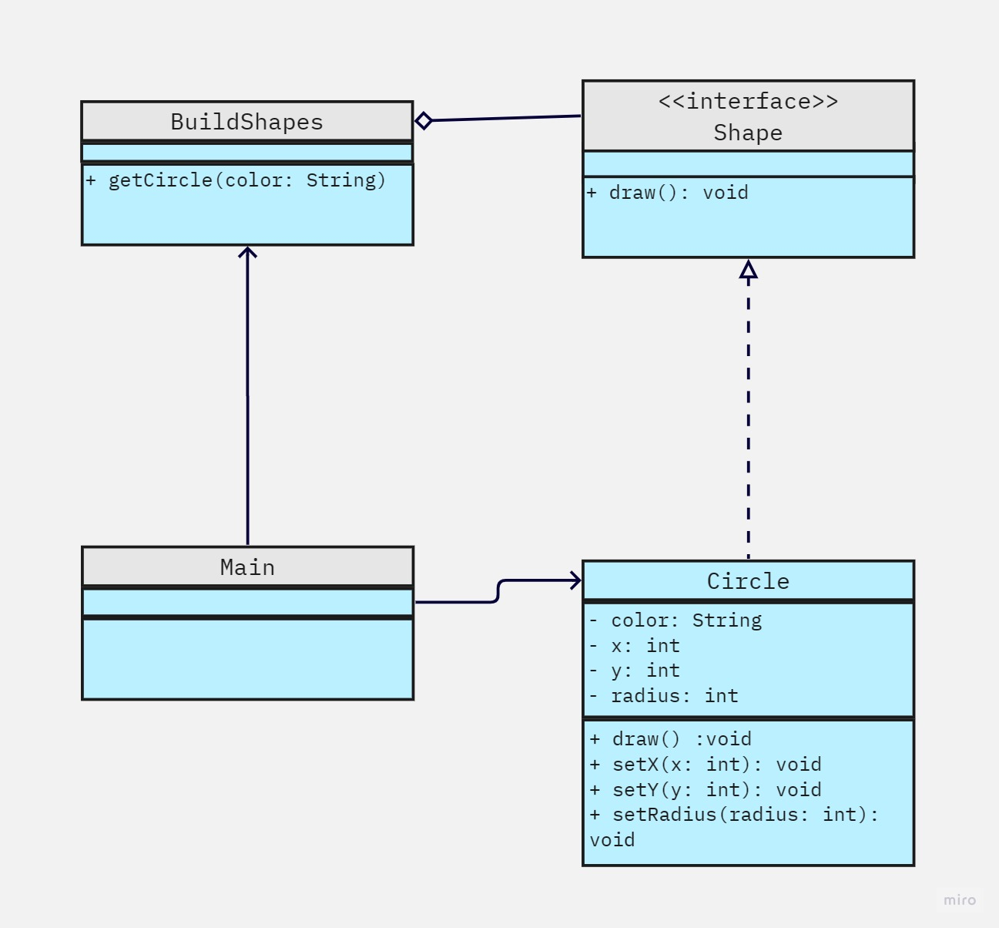

<h1 style="text-align: center;">Flyweight</h1>

## ¿Qué es?

Es un patrón de diseño estructural que se utiliza en programación para 
optimizar el uso de objetos cuando se trabaja con una gran cantidad de 
instancias de un mismo tipo. Su principal objetivo es minimizar el consumo de 
memoria o recursos al compartir datos comunes entre múltiples objetos en lugar de 
replicar estos datos en cada objeto individual.

## Estructura
Objeto compartido que se puede usar a la vez en varios contextos
Necesita dos estados:
- Estado intríseco  (Compartido en cualquier contexto)
- Estado extrínseco (T)

## ¿Cuándo es bueno usarlo?
- La aplicacion tiene gran cantidad de objetos
- El costo de almacenamiento es elevado.
- La aplicacion no depende de la identidad de los objetos.
- Muchos objetos pueden ser remplazados por pocos objetos compartidos.

## Consecuencias
- Aumento de costos en cuestion de tiempo de ejecución.
- Entre mas objetos se compartan hay un mayor ahorro de recursos.

## Demo

+ [Codigo aquí]()

